# 🚀 Jenkins Docker Node.js  Jenkins executes 4-stage CI/CD pipeline:
  - `docker-build` → `docker-test` → `docker-push` → `docker-deploy`

This document guides you through setting up a complete in **Jenkins** using **Docker** for a **Node.js** application with 4 freestyle jobs:

---

## 🔧 1. Jenkins Job: `docker-build`

### ✅ Purpose:

- Build Docker image from Node.js application source code in GitHub.
## 📸 Screenshot

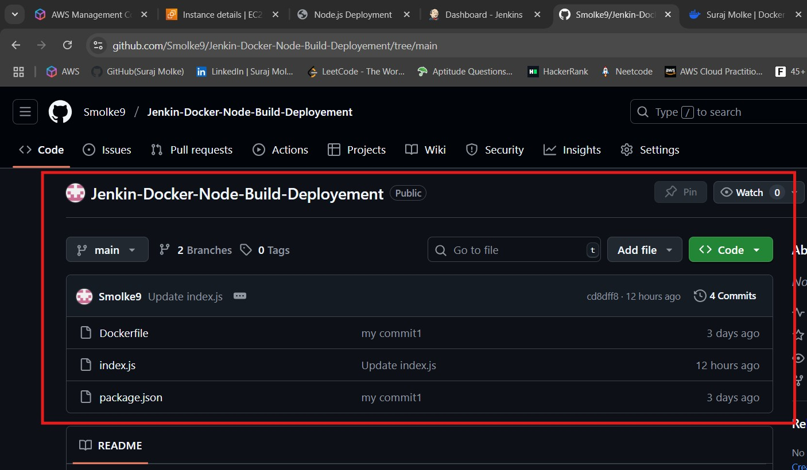


### 📌 Configuration:

- **Project Type**: Freestyle Project
- **SCM**: Git → `https://github.com/Smolke9/Jenkin-Docker-Node-Build-Deployement.git`
- **Build Triggers**: `GitHub hook trigger for GITScm polling`
- **Build Steps**:
  ```bash
  sudo docker build -t myapp .
  sudo docker images
  ```
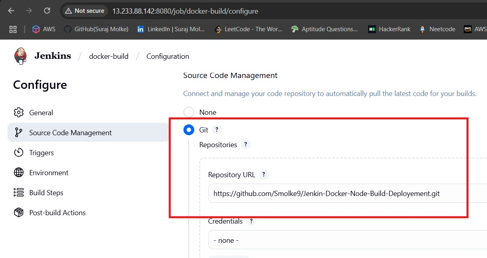
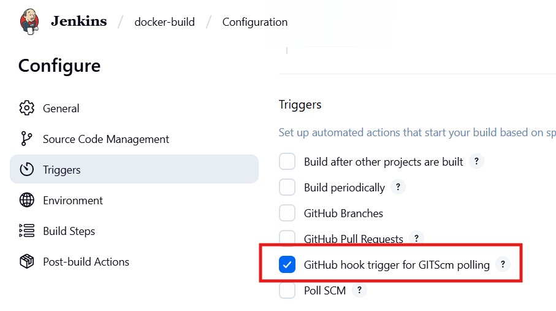
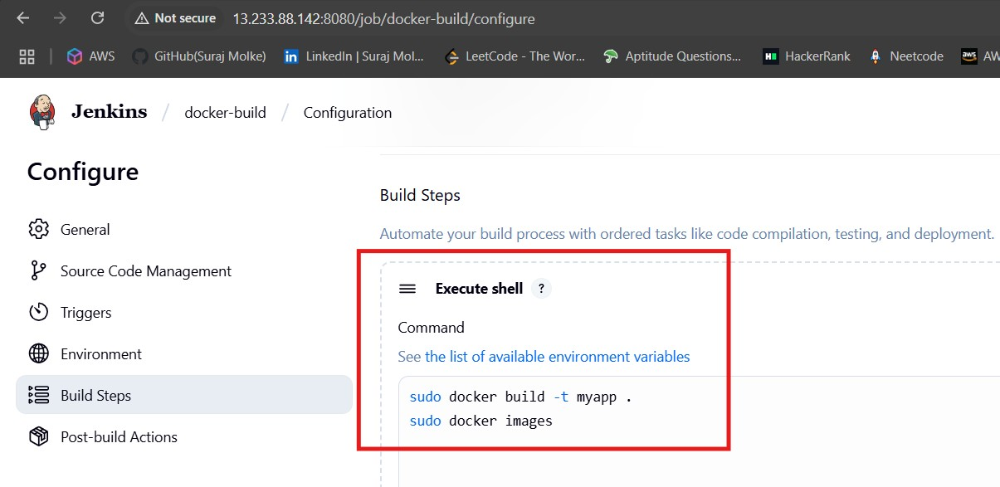

After successful build, image `myapp` should be visible on your EC2 instance via `docker images`.

---

## 🔧 2. Jenkins Job: `docker-test`

### ✅ Purpose:

- Run container locally to test image

### 📌 Configuration:

- **Project Type**: Freestyle Project
- **SCM**: Git → `https://github.com/Smolke9/Jenkin-Docker-Node-Build-Deployement.git`
- **Build Trigger**:
  - `Build after other projects are built`
  - **Project to watch**: `docker-build`
  - Check: `Trigger only if build is stable`
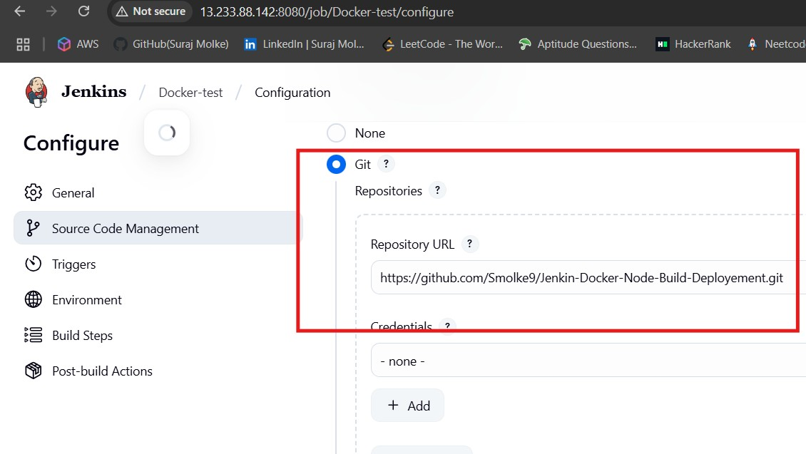
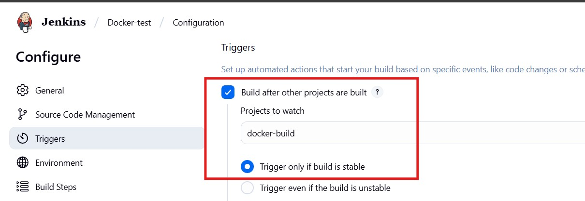
### **Build Steps (Execute Shell)**:

```bash
sudo docker stop nodecontainer || true
sudo docker rm nodecontainer || true
sudo docker run -d -p 80:3000 --name nodecontainer myapp
sudo docker container ls
```
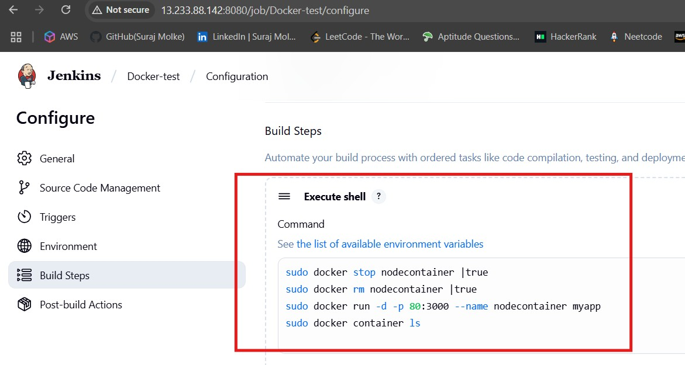
---

## 🔧 3. Jenkins Job: `docker-push`

### ✅ Purpose:

- Tag and push Docker image to Docker Hub.
Create Repo in DockerHub
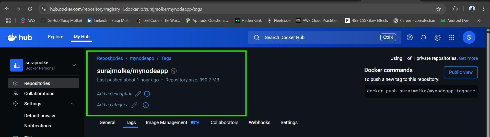
### 📌 Configuration:

- **SCM**: None
- **Trigger**: `Build after other projects are built`
  - **Project to watch**: `docker-test`
  - Check: `Trigger only if build is stable`

### **Build Steps (Execute Shell)**:

```bash
sudo docker login -u surajmolke -p dockerhubTockenPaste
sudo docker container l
sudo docker stop mynodecont || true
sudo docker rm mynodecont || true
sudo docker tag myapp surajmolke/mynodeapp:v1
sudo docker push surajmolke/mynodeapp:v1
sudo docker ps
```
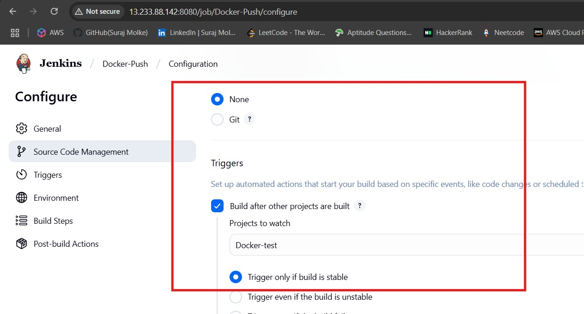

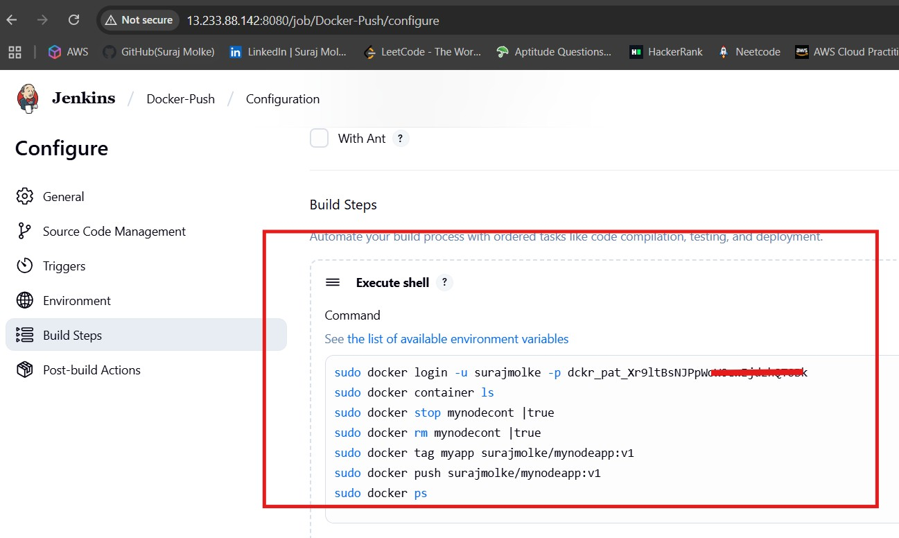

After this step, image `surajmolke/mynodeapp:v1` should be available on Docker Hub.

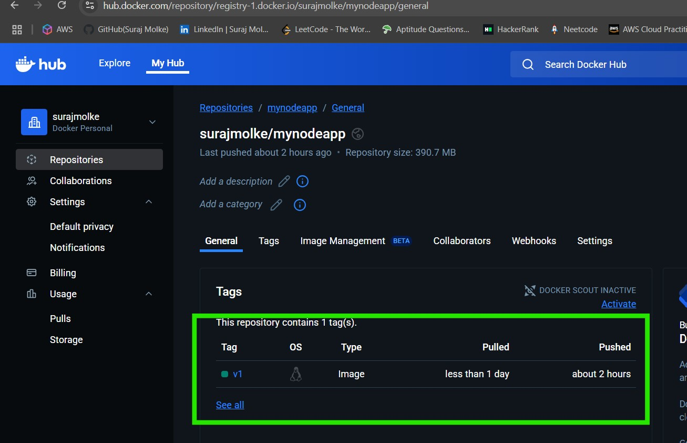
---
### ⚙️ SSH Setup:

- Install **SSH Plugin** from Jenkins Plugin Manager
- Go to **Jenkins > Manage Jenkins > Configure System**
- Under **SSH remote hosts**:
  - Add Host:
    - **Hostname**: `Remote EC2 Public IP`
    - **Port**: `22`
    - **Credentials**: Create **Global Credentials** with:
      - **Kind**: `SSH Username with Private Key`
      - **Username**: `ubuntu`
      - **Private Key**: paste your remote EC2 private key (PEM file content)

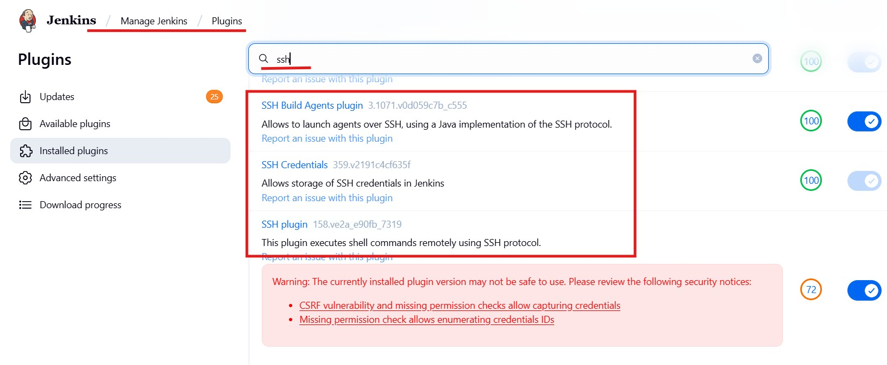
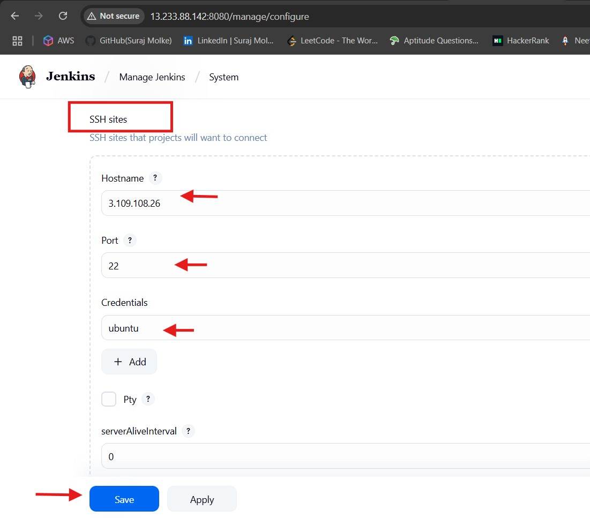
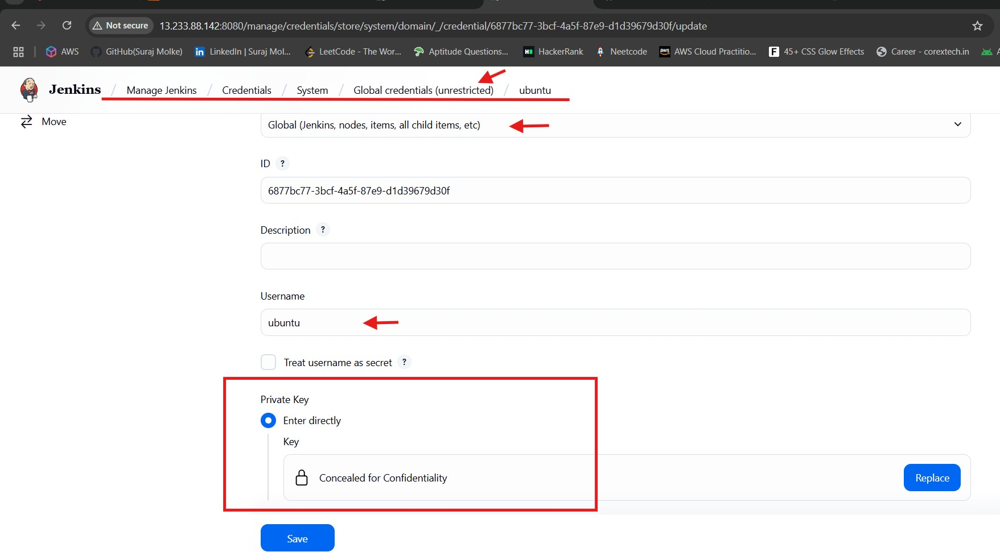
  
## 🔧 4. Jenkins Job: `docker-deploy`

### ✅ Purpose:

- Pull and run Docker image on a **remote Ubuntu server** via SSH.

### 📌 Configuration:

- **SCM**: None
- **Build Trigger**:
  - `Build after other projects are built`
  - **Project to watch**: `docker-push`


### **Build Step: Execute shell script on remote host using SSH**:

```bash
sudo apt update
sudo apt install docker.io -y
sudo apt install nginx -y
sudo docker stop mynodecont || true
sudo docker rm mynodecont || true
sudo docker pull swatizcloud/mynodeapp:v1
sudo docker run -d -p 80:3000 --name mynodecont swatizcloud/mynodeapp:v1
sudo docker ps
```

After this step, the Node.js app will be running on port `80` of the **remote server**.

---

## ✅ Final Output:

- Jenkins executes 4-stage CI/CD pipeline:
  - `docker-build` → `docker-test` → `docker-push` → `docker-deploy`
- Image is built, tested, pushed to Docker Hub, then deployed to remote EC2 instance via SSH.

---


